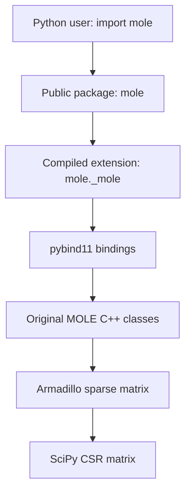

# MOLE Python Interface: Technical Reference and Q&A

> Internal reference for explaining the Python interface added to MOLE. This is not intended to replace the public project README.

## 1. Executive summary

MOLE remains a C++ numerical library. The Python work did not migrate or rewrite the numerical algorithms. It added a Python interface around the existing C++ implementation using pybind11.

Python users can now write:

```python
import mole

L = mole.laplacian_1d(order=2, cells=10, dx=0.1)
print(type(L))
print(L.shape)
```

The operator is constructed by the original C++ code and returned as a `scipy.sparse.csr_matrix`.

The maintenance model is:

- Numerical algorithms remain in C++.
- The bindings translate arguments and return values.
- Changes to an existing C++ implementation automatically reach Python after recompilation, provided its public C++ signature remains compatible.
- A new C++ operator or a changed signature requires a corresponding binding update.

## 2. Why add a Python interface?

The Python interface makes MOLE accessible to users who work with NumPy, SciPy, Matplotlib, Jupyter, and the broader scientific Python ecosystem.

It provides:

- Familiar Python function calls.
- SciPy-compatible sparse matrices.
- NumPy arrays for dense vectors and weights.
- Python exceptions for invalid inputs handled by the bindings.
- Autocompletion and static typing through `.pyi` stubs.
- Python examples and automated tests.
- A binary wheel that can be installed with `pip` without compiling MOLE locally.

## 3. What was not changed?

The following remain true:

- MOLE is still implemented in C++.
- Existing C++ examples and tests remain supported.
- The Python interface does not replace C++.
- The numerical formulas are not duplicated in Python.
- C++ and Python can be built independently.

## 4. Architecture



When a user calls:

```python
G = mole.gradient_1d(2, 10, 0.1)
```

the execution path is:

1. Python calls `mole.gradient_1d`.
2. `mole/__init__.py` exposes the compiled binding.
3. pybind11 converts Python scalars to C++ types.
4. The binding calls `Gradient(order, cells, dx)`.
5. MOLE constructs the operator in C++.
6. The Armadillo sparse matrix is converted to SciPy CSR.
7. Python receives an independent sparse matrix object.

## 5. Important files

### Binding implementation

| File | Responsibility |
| --- | --- |
| `python/bindings/common.h` | Shared includes and C++/Python conversion helpers |
| `python/bindings/module.cpp` | Creates `_mole` and registers each binding group |
| `python/bindings/operators.cpp` | Laplacian, gradient, divergence, and weight functions |
| `python/bindings/interpolation.cpp` | Standard, alternate, and specialized interpolation functions |
| `python/bindings/boundary_conditions.cpp` | Boundary-aware, Robin, and mixed operators |
| `python/bindings/add_scalar_bc.cpp` | Functions that apply scalar boundary conditions to systems |
| `python/CMakeLists.txt` | Builds and installs the compiled Python extension |

### Python package

| File | Responsibility |
| --- | --- |
| `python/mole/__init__.py` | Defines the explicit public API used with `import mole` |
| `python/mole/_mole.pyi` | Static type information for the compiled extension |
| `python/mole/py.typed` | Marks the installed package as typed |
| `pyproject.toml` | Package metadata, dependencies, and wheel configuration |

### Tests and examples

| Location | Responsibility |
| --- | --- |
| `tests/python/` | Tests the freshly compiled `_mole` extension directly |
| `tests/wheel/` | Tests the installed public package with `import mole` |
| `examples/python/` | User-facing Python examples |
| `examples/cpp/` | Original C++ examples |

## 6. Why is the compiled module named `_mole`?

The leading underscore marks the binary extension as an implementation detail:

```python
from ._mole import laplacian_1d
```

Users should write:

```python
import mole
```

and not:

```python
import _mole
```

This separation allows the public Python package to add documentation, aliases, validation, convenience functions, and version information without changing the compiled module.

Internal binding tests intentionally import `_mole` from `build/python`. This ensures that they test the newly compiled extension rather than a previously installed wheel.

## 7. Why use `gradient_1d`, `gradient_2d`, and `gradient_3d`?

C++ uses overloaded constructors:

```cpp
Gradient(order, cells, dx);                         // 1D
Gradient(order, cells_x, cells_y, dx, dy);          // 2D
Gradient(order, cells_x, cells_y, cells_z, dx, dy, dz); // 3D
```

The Python API uses explicit dimension-specific names:

```python
mole.gradient_1d(...)
mole.gradient_2d(...)
mole.gradient_3d(...)
```

This was a usability decision. Explicit names are friendlier for new users because:

- The dimension is immediately visible.
- Users do not need to infer the overload from the number of arguments.
- Autocompletion is clearer.
- Type stubs are simpler.
- Documentation and error messages can be specific.
- Scientific code is easier to read.

## 8. How a binding definition works

Example:

```cpp
module.def(
    "gradient_1d",
    [](u16 order, u32 cells, Real dx) {
        Gradient matrix(order, cells, dx);
        return to_scipy_csr(matrix);
    },
    py::arg("order"),
    py::arg("cells"),
    py::arg("dx"),
    "Construct a non-periodic 1-D mimetic gradient."
);
```

This code:

1. Registers a Python function named `gradient_1d`.
2. Converts Python arguments to `u16`, `u32`, and `Real`.
3. Calls the original C++ `Gradient` constructor.
4. Converts the resulting Armadillo matrix to SciPy CSR.
5. Adds named Python arguments and a docstring.

The binding adapts the interface; it does not implement the gradient formula.

## 9. Matrix conversion

The current conversion helper uses this route:

```text
Armadillo sp_mat → COO triplets → SciPy COO → SciPy CSR
```

For every nonzero entry, it records:

```text
row, column, value
```

It then performs the Python equivalent of:

```python
coo = scipy.sparse.coo_matrix(
    (values, (rows, columns)),
    shape=(number_of_rows, number_of_columns),
)
csr = coo.tocsr()
```

The explicit shape preserves completely empty rows or columns.

The conversion copies the matrix data. This means the returned SciPy matrix remains valid after the temporary C++ matrix is destroyed.

### Does it import SciPy for every conversion?

The helper calls `py::module_::import("scipy.sparse")` for every conversion. Python caches imported modules in `sys.modules`, so only the first call performs the expensive module initialization. Later calls retrieve the cached module.

### Possible future optimization

Armadillo stores sparse matrices in CSC form. A faster converter could copy Armadillo's CSC arrays directly into a SciPy CSC matrix and then call `.tocsr()`, avoiding the COO intermediate representation. This should be changed only after benchmarking and adding equivalence tests.

## 10. Data conversions

The bindings use several conversion directions:

| C++ data | Python data |
| --- | --- |
| `sp_mat` | `scipy.sparse.csr_matrix` |
| Armadillo dense vector | `numpy.ndarray` |
| NumPy integer array | Armadillo integer vector |
| Python integer | `u16` or `u32` |
| Python float | `Real` (`double`) |

Boundary arrays are checked for dimensionality and length before being passed to C++:

- 1D: 2 entries — left, right
- 2D: 4 entries — left, right, bottom, top
- 3D: 6 entries — left, right, bottom, top, front, back

## 11. Public API

The Python package exposes 44 public functions in these groups:

- Laplacian: 1D, 2D, and 3D.
- Gradient: 1D, 2D, and 3D.
- Divergence: 1D, 2D, and 3D.
- Boundary-aware gradient and divergence.
- Gradient and divergence weights.
- Standard interpolation.
- Alternate interpolation.
- Cell-to-face, face-to-cell, cell-to-node, and node-to-cell interpolation.
- Robin boundary-condition operators.
- Mixed boundary-condition operators.
- Scalar boundary-condition application in 1D, 2D, and 3D.

`python/mole/__init__.py` explicitly lists the public names. It does not use `from ._mole import *`. This prevents accidental API expansion and makes review easier.

## 12. Type stubs

`_mole` is a compiled `.so` file, so editors cannot reliably infer all signatures from source code. The file:

```text
python/mole/_mole.pyi
```

describes the functions, arguments, return values, and docstrings for static analysis.

The marker:

```text
python/mole/py.typed
```

tells tools such as Pylance, Pyright, and mypy to use the distributed typing information.

Stubs affect editor assistance only. They do not execute and do not change numerical performance.

Regenerate or update the stubs when:

- A public function is added or removed.
- A signature changes.
- A return type changes.

An internal numerical improvement that preserves the signature does not require a stub change.

## 13. Build options

The CMake project separates C++ and Python concerns:

| Option | Meaning | Default |
| --- | --- | --- |
| `MOLE_BUILD_PYTHON` | Build the pybind11 extension | `OFF` |
| `MOLE_INSTALL_CPP_LIBRARY` | Install the standalone C++ library and headers | `ON` |
| `MOLE_BUILD_EXAMPLES` | Build C++ examples | `ON` |
| `BUILD_TESTING` | Build and register tests | Controlled by CTest |

Examples:

```bash
# C++ only
cmake -S . -B build \
  -DMOLE_BUILD_PYTHON=OFF \
  -DMOLE_INSTALL_CPP_LIBRARY=ON
```

```bash
# C++ and Python development
cmake -S . -B build \
  -DMOLE_BUILD_PYTHON=ON \
  -DMOLE_INSTALL_CPP_LIBRARY=ON \
  -DBUILD_TESTING=ON
```

```bash
# Python wheel configuration
-DMOLE_BUILD_PYTHON=ON
-DMOLE_INSTALL_CPP_LIBRARY=OFF
-DBUILD_TESTING=OFF
-DMOLE_BUILD_EXAMPLES=OFF
```

The Python wheel excludes `libmole_C++.a` because the compiled extension already contains the linked MOLE code. The standalone C++ installation remains available through CMake and includes the C++ library and public headers.

## 14. Python packaging

The distribution name is:

```text
mole-mimetic
```

The import name is:

```python
import mole
```

The current version is:

```text
0.1.0
```

Core Python dependencies are declared in `pyproject.toml`:

```text
NumPy >= 1.23
SciPy >= 1.9
```

Build dependencies include scikit-build-core and pybind11.

## 15. Editable installation for development

On the tested Apple Silicon development machine:

```bash
conda create -n molenevironment python=3.12 -y
conda activate molenevironment

python -m pip install --upgrade pip
python -m pip install numpy scipy pytest pybind11 scikit-build-core build
```

Because Homebrew's `eigen@3` is keg-only and Eigen 5 may otherwise be selected, the editable build uses:

```bash
CMAKE_ARGS="-DEigen3_DIR=$(brew --prefix eigen@3)/share/eigen3/cmake" \
python -m pip install -e .
```

The other wheel options are stored in `pyproject.toml` and do not need to be repeated in `CMAKE_ARGS`.

This Eigen argument is a source-build detail on the tested macOS configuration. Users installing a prebuilt wheel do not need CMake, Eigen, pybind11, or a C++ compiler.

## 16. Building a wheel

```bash
CMAKE_ARGS="-DEigen3_DIR=$(brew --prefix eigen@3)/share/eigen3/cmake" \
python -m build --wheel
```

The validated wheel was:

```text
mole_mimetic-0.1.0-cp312-cp312-macosx_26_0_arm64.whl
```

This filename means:

- CPython 3.12.
- CPython 3.12 ABI.
- macOS 26 deployment tag.
- ARM64 architecture.

This one wheel is not portable to every Python version or operating system. Additional wheels must be built and tested separately.

## 17. Clean wheel validation

The wheel was installed in a newly created Python 3.12 Conda environment. `pip` automatically installed NumPy and SciPy. Testing from `/tmp` confirmed that Python loaded:

```text
.../site-packages/mole/__init__.py
```

rather than the source tree.

The validation confirmed:

- `import mole` works.
- `mole.__version__ == "0.1.0"`.
- Operators return SciPy CSR matrices.
- `_mole.pyi` is included.
- `py.typed` is included.
- The bundled Armadillo dynamic libraries load correctly.
- The wheel does not contain the standalone `libmole_C++.a`.

## 18. Testing strategy

### Internal binding tests

```bash
PYTHONPATH="$PWD/build/python" \
python -m pytest tests/python -v
```

There are 149 internal Python tests covering:

- Operator construction and shapes.
- Nullity properties.
- Interpolation functions.
- Numerical convergence.
- An eigenvalue problem.
- Spacing validation.
- Boundary operators.
- Scalar boundary-condition application.
- Mimetic weights.

### Public wheel tests

There are 49 wheel tests covering:

- `import mole`.
- Package and distribution versions.
- All 44 public functions.
- `__all__` consistency.
- CSR return type.
- Basic operator application.
- Separation of `_mole` from the public API.

### Combined CTest integration

CTest registers seven C++ test executables and one Python test entry:

```bash
ctest --test-dir build --output-on-failure
```

The Python CTest entry executes the 149 internal pytest tests.

## 19. Important test preconditions discovered

Running with C++ assertions enabled exposed invalid test grids that Release builds had previously hidden.

For the relevant constructors:

```text
Gradient:   cells >= 2 * order
Divergence: cells >  2 * order
```

For tests shared by both, the safe choice is:

```python
cells = 2 * order + 1
```

For `order=2`, this means at least 5 cells in every applicable direction. Tests should never depend on Release mode disabling C++ assertions.

## 20. Why can C++ print tiny values where Python prints zero?

Values such as:

```text
1.9984e-15
-1.83187e-15
```

are floating-point roundoff and are numerical zeros. With solution magnitudes near 20, errors around `1e-15` are consistent with double-precision arithmetic.

C++ and Python may use different sparse-solver orderings, pivot paths, or output formatting. One example also printed fewer significant digits in C++. Comparisons should use tolerances, not exact string equality:

```python
numpy.allclose(cpp_solution, python_solution, rtol=1e-5, atol=1e-12)
```

The validated elliptic 3D comparison had a relative L2 difference around `2.2e-6`; most of the visible difference came from limited C++ output precision.

## 21. Maintenance rules

### Change only C++ when

- Fixing or optimizing an existing algorithm.
- Preserving the same constructor and data types.
- Preserving the same return concept.

Rebuild the extension or wheel afterward.

### Change bindings when

- Adding a new C++ class or function to Python.
- Adding or removing an overload.
- Changing argument types or order.
- Changing returned data structures.
- Adding Python-specific validation.

### Change the public Python package when

- Adding or removing a public name.
- Adding Python convenience functions.
- Changing package-level documentation or version information.

### Change stubs when

- Public signatures or return types change.

### Change tests whenever

- Behavior changes.
- A regression is fixed.
- A new function is exposed.
- A new platform or Python version is supported.

## 22. Current limitations and future work

- Build and test wheels on Linux, additional macOS targets, and potentially Windows.
- Test Python 3.9–3.13 rather than relying only on the declared range.
- Add CI that builds C++, runs 149 binding tests, builds the wheel, installs it cleanly, and runs 49 public API tests.
- Improve portable discovery of Eigen, OpenBLAS, LAPACK, and libomp.
- Add `MOLEConfig.cmake`, an exported `MOLE::mole` target, and dependency propagation for downstream C++ projects.
- Benchmark the COO-to-CSR conversion and evaluate a direct CSC route.
- Expand docstrings with exact input and output shapes.
- Publish to TestPyPI before an authorized production PyPI release.
- Add a changelog and reproducible release workflow.

## 23. Frequently asked questions

### Was MOLE rewritten in Python?

No. Python calls the original C++ implementation through pybind11.

### Will a C++ numerical improvement reach Python?

Yes, after rebuilding, as long as the C++ API used by the binding remains compatible.

### Why return SciPy sparse matrices?

They integrate directly with SciPy solvers and avoid converting large sparse operators into dense arrays.

### Why CSR rather than a custom Python matrix class?

CSR is familiar to scientific Python users and interoperates with existing numerical tools.

### Why not expose the C++ classes directly?

Function-based constructors produce a simpler Python API and return standard SciPy objects. Users do not need to learn Armadillo-specific behavior.

### Why not use one overloaded `gradient` function?

Dimension-specific names are easier to discover, document, type, and understand, especially for new users.

### Why do internal tests import `_mole`?

To ensure they test the newly compiled extension. Public wheel tests separately validate `import mole`.

### Does every matrix conversion reload SciPy?

No. Python caches imported modules. Repeated imports mainly retrieve the cached module reference.

### Does the current converter copy matrix data?

Yes. The copy gives the returned Python matrix independent ownership and a safe lifetime.

### Can the conversion be faster?

Possibly. A direct Armadillo CSC to SciPy CSC conversion may avoid the COO intermediate step. It should be benchmarked before replacing the simpler implementation.

### Why was `libmole_C++.a` removed from the wheel?

The wheel is a Python distribution, and `_mole` already links the required MOLE code. Standalone C++ installation remains separately available through CMake.

### Is the C++ version still supported?

Yes. `MOLE_BUILD_PYTHON=OFF` builds MOLE without requiring Python or pybind11, while `MOLE_INSTALL_CPP_LIBRARY=ON` installs its library and headers.

### Why is `CMAKE_ARGS` needed on the development Mac?

Homebrew's Eigen 3 formula is keg-only while Eigen 5 may be linked by default. `CMAKE_ARGS` tells the isolated Python build exactly where the compatible Eigen 3 configuration is located. Wheel users do not need this argument.

### Is the package already universally portable?

No. The validated wheel is specific to CPython 3.12 on ARM64 macOS 26. CI and additional wheel builds are needed for broader support.

### Are values around `1e-15` errors?

They are normally floating-point roundoff and should be treated as zero under a suitable absolute tolerance.

## 24. Short explanation for a presentation

> We added a pybind11 interface to MOLE without rewriting its numerical algorithms. Python arguments are converted to the types expected by the original C++ constructors, and Armadillo sparse matrices are returned as SciPy CSR matrices. The public `mole` package exposes an explicit, dimension-specific API designed to be approachable for new users. The C++ and Python installation paths remain independent, and both the raw bindings and installed wheel are covered by automated tests.

## 25. Current verification snapshot

At the time this reference was prepared:

- The C++ test suite passed.
- All 149 internal Python tests passed with C++ assertions enabled.
- All 49 installed-wheel public API tests passed.
- C++ and Python example results agreed within expected floating-point and output-format tolerances.
- A clean CPython 3.12 ARM64 macOS wheel installation succeeded.

